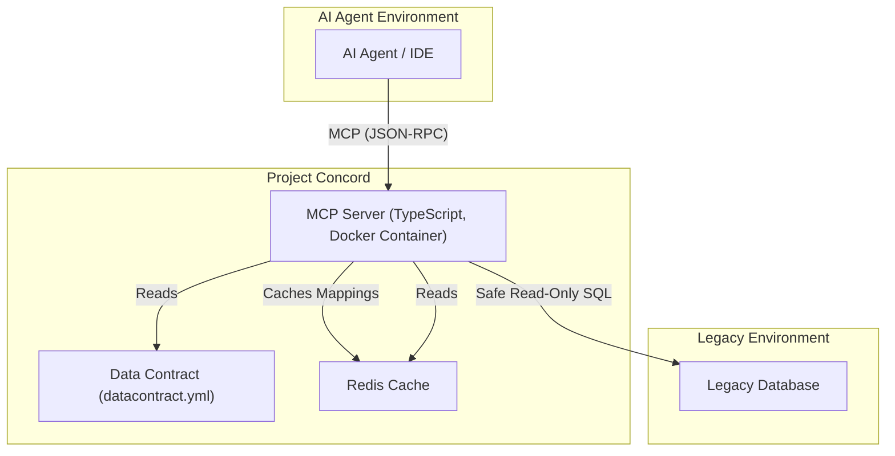

# Project Concord

[](https://github.com/limcheekin/project-concord/actions/workflows/ci.yml)
[](https://deepwiki.com/limcheekin/project-concord)

Project Concord is a headless, ambiguity-resistant **Model Context Protocol (MCP)** server that acts as a semantic mediation layer between modern AI agents and legacy database schemas. It is designed to unlock the value of core data assets by translating cryptic, legacy schemas into a clear, reliable, and AI-ready interface, mitigating significant operational risk and unblocking AI initiatives.

## 😟 The Problem

Legacy database schemas often represent a significant business liability. Technical debt, characterized by cryptic naming conventions, unwritten business rules, and inconsistent structures, creates an "interpretation gap" for modern AI agents. This gap leads to:

- **High Financial Costs:** Schema-related integration failures and remediation efforts are costly.
- **Severe Operational Risk:** Ambiguities can cause erroneous data retrieval and even catastrophic data integrity violations.
- **Blocked Innovation:** The "legacy data dilemma" is a fundamental barrier to safely deploying agentic AI and leveraging core data assets for a competitive advantage.

## ✨ The Solution

Project Concord provides an intelligent and defensible bridge between ambiguous legacy database schemas and modern AI systems. It functions as a **Custom Metadata-Enriching Server**, exposing a clean, semantically rich set of "tools" that an AI agent can reliably use to query the database.

The server's core responsibility is to translate a simple, well-documented request from an AI into a safe, accurate SQL query for the legacy database, based on a formal **Data Contract**.

## 📌 Key Features

- 🗣️ **Semantic Mediation:** Translates business concepts into safe and accurate database queries.
- 📝 **Data Contract Driven:** Uses a version-controlled `datacontract.yml` as a single source of truth for schema definitions, business rules, and semantic mappings. For example:
  ```yaml
  tables:
    cust_mst:
      businessName: Customer
      description: "Represents a customer entity."
      columns:
        c_id:
          businessName: "Customer ID"
          description: "The unique identifier for a customer."
        c_name:
          businessName: "Customer Name"
          description: "The name of the customer."
  ```
- 🛡️ **Read-Only Safety:** The initial implementation is strictly limited to read-only operations to eliminate the risk of data modification.
- 📊 **Observability:** Provides comprehensive, structured logging to monitor AI interactions, analyze query patterns, and identify potential issues.
- 🐳 **Containerized & Portable:** Packaged as a Docker container for consistent deployment across any environment.
- ⚡ **High Performance:** Utilizes a Redis cache for semantic mappings to ensure low-latency responses.

## 🛠️ Technology Stack

- **Language & Runtime:** [TypeScript](https://www.typescriptlang.org/) (~5.5.3) on [Node.js](https://nodejs.org/) (>=18)
- **Monorepo:** [Turborepo](https://turbo.build/repo) (~2.0) for high-performance builds.
- **Web Framework:** [Hono](https://hono.dev/) (^4.5.1) for the HTTP transport layer.
- **MCP SDK:** [@modelcontextprotocol/sdk](https://www.npmjs.com/package/@modelcontextprotocol/sdk) (~1.1) for core protocol implementation.
- **Testing:** [Vitest](https://vitest.dev/) (^1.6.0) for unit and integration tests.
- **Containerization:** [Docker](https://www.docker.com/) for consistent, portable deployments.
- **Services:** [PostgreSQL](https://www.postgresql.org/) (17.x) for the test database and [Redis](https://redis.io/) (8.2) for caching.
- **Linting & Formatting:** [ESLint](https://eslint.org/) (~9.5) and [Prettier](https://prettier.io/) to maintain code quality.

## 🏗️ Architecture Overview

Project Concord is a TypeScript-based monorepo managed by **Turborepo**. The primary application is a headless server built with **Hono** and the production-grade TypeScript template [mcp-ts-template](https://github.com/cyanheads/mcp-ts-template).



For a more detailed explanation of the architecture, please see the [Architecture Document](./docs/architecture.md).

## 🔒 Security Considerations

This project is designed with security in mind. Key principles include:

- **Least Privilege:** The database connection for the server should be configured with read-only permissions.
- **Strict Input Validation:** All incoming requests from AI agents are rigorously validated against a schema defined in the Data Contract.
- **Dependency Scanning:** The CI/CD pipeline should be configured to scan for known vulnerabilities in third-party packages.

## 🚀 Getting Started

Follow these instructions to set up and run the project on your local machine for development and testing purposes.

### ✅ Prerequisites

- [Node.js](https://nodejs.org/) (~20.x LTS)
- [Docker](https://www.docker.com/products/docker-desktop/) and Docker Compose

### 📦 Installation & Setup

1.  **Clone the repository:**
    Navigate to the directory where you want to store the project and clone the repository.
    ```sh
    git clone https://github.com/limcheekin/project-concord.git
    cd project-concord
    ```

2.  **Create the environment file:**
    Copy the example environment file. You may need to update it with your database credentials if you are not using the default test database.
    ```sh
    cp .env.example .env
    ```

3.  **Launch services:**
    Ensure the Docker daemon is running on your machine. Then, start the required services (Postgres database, Redis cache, and the MCP server) using Docker Compose.
    ```sh
    docker compose up -d
    ```

4.  **Install dependencies:**
    Install the project dependencies using npm.
    ```sh
    npm install
    ```

5.  **Seed the test database:**
    Populate the test database with initial data.
    ```sh
    npm run seed-test-db
    ```

### ✔️ Verification

The server runs as a headless API on port 3010. To verify that it is running correctly, you can send a request using `curl`.

```sh
curl http://localhost:3010/
```

A successful response should be a JSON object containing information about the service, such as its name and version, provided by the MCP SDK. This confirms that the server is up and running.

### ❓ Troubleshooting

- **Port Conflicts:** If `docker compose up` fails with an error about a port being "already allocated," it means another service on your machine is using one of the required ports (e.g., 3010, 5432, or 6379). Stop the conflicting service or change the port mappings in the `docker-compose.yml` file.

### 👉 Next Steps

Once the server is running, here are some things you can do:

- **Run the tests:** Execute `npm test` to run the full suite of unit and integration tests.
- **Explore the code:** The main server logic is in `apps/mcp-server/src/index.ts`. The data contract is defined in `packages/data-contract/datacontract.yml`.
- **Make a change:** Try adding a new definition to the data contract and see how the server's behavior changes.

## 📜 Available Scripts

This project uses npm scripts managed by Turborepo to orchestrate common tasks. All scripts should be run from the root of the monorepo.

-   `npm run dev`: Starts the development servers for all applications with hot-reloading.
-   `npm run build`: Builds all applications and packages in the monorepo.
-   `npm run test`: Runs the complete test suite for all packages.
-   `npm run lint`: Lints the entire codebase to check for style issues.
-   `npm run seed-test-db`: Seeds the test database with initial data.

## 📂 Project Structure

The monorepo is organized into two main directories:

-   `apps/`: Contains the main applications.
    -   `mcp-server`: The primary, headless MCP server application.
-   `packages/`: Contains shared libraries and configurations.
    -   `data-contract`: The single source of truth for the schema contract (`datacontract.yml`) and related types.
    -   `eslint-config`: Shared ESLint configuration.
    -   `typescript-config`: Shared `tsconfig.json` settings.

## 🙌 Contributing

Contributions are welcome! Please see our [Contributing Guide](CONTRIBUTING.md) for details on how to get started, report bugs, and submit pull requests.

## 🗺️ Roadmap

This project is under active development. The following features and enhancements are planned, based on the architect's recommendations, and represent great opportunities for contribution:

- **Enhanced Caching:** Fully implement the Redis cache-aside pattern in the `redis.ts` service to reduce load on the legacy database.
- **Production-Grade Configuration:** Adopt a hierarchical configuration library like `config` to manage environment-specific settings more robustly.
- **Advanced Input Validation:** Integrate a library like **Zod** to define and enforce schemas for all tool inputs, enhancing security and reliability.
- **Comprehensive Observability:** Instrument the application with **OpenTelemetry** to provide distributed tracing and expose key metrics.
- **Security Hardening:** Implement security measures like **Helmet.js** for security headers, **rate limiting**, and integrating a dependency scanner like **Snyk** into the CI pipeline.

## 🙏 Acknowledgements

This project is based on the [mcp-ts-template](https://github.com/cyanheads/mcp-ts-template) by [Casey](https://caseyjhand.com/) and developed using the [BMAD-METHOD](https://github.com/bmad-code-org/BMAD-METHOD).


## 💼 Commercial Usage

The Project Concord is free for production use by organizations (including parent companies, subsidiaries, and affiliates) with Total Annual Gross Revenue under $5M USD in the previous fiscal year. If you want to use the project commercially over the revenue limit, please [contact us](mailto:limcheekin@vobject.com?subject=Project%20Concord%20Commercial%20Licensing&body=Describe%20your%20use%20case%20and%20revenue%20size.) for commercial licensing options.

## 📄 License

This project is licensed under the BSL-1.1 License. See the [LICENSE](./LICENSE) file for details.
